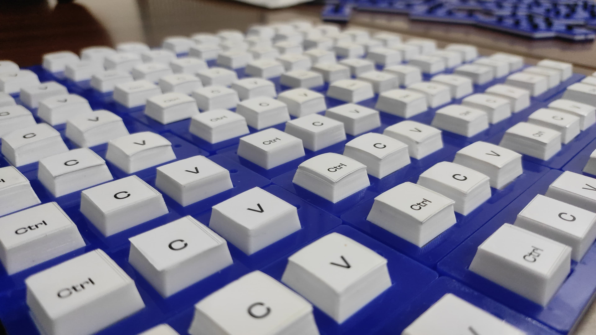

# Fidget-A-Ton

As the organizers of Make-A-Ton 6.0, our goal was to provide the best hacker experience. One of the ideas that popped up was to create a custom swag, as a memorable souvenir for participants at Make-A-Ton 6.0. So, I designed and "mass manufactured" 100 small keyboards featuring Ctrl, C, and V keys with a micro switch inside, for that satisfying "clicky" feel and sound. The design is really simple, and you can try making one at a nearby Fablab. The whole exp was really fun!

## Machines Used

- **3D Printer:** Find one at a Fablab in your college or from hacker communities like [TinkerSpace Kochi](https://www.tinkerhub.org/tinkerspace). Use it for printing the keycaps and the jig.

- **Laser Cutter:** For cutting acrylic sheets. This machine is available at Fablabs or shops dealing with items like name and signboards.

- If you're in Kochi, both of these machines are available at [Fablab Cusat](https://tbi.cusat.ac.in/team/fablab.html), which is open to the public.

## Materials Used

- Acrylic sheet with a thickness of 3 mm
- Acrylic glue
- Micro switch: This is the easiest and most cost-effective way to achieve the clicky feel and that satisfying, short, and sharp sound – it truly enhances the entire experience 📈
- 3D printer filament: Used for the jig and keycaps.

Cut the sheets, 3D print the jig and keycaps, purchase three micro switches of the correct size from an electronics store, assemble and start the clickety-clackety fun!

If you have any ideas for fidget toys that hackers/devs would love to have on their table, just lmk and I'll try to forge it in my free time. 
Connect with me on [Linkedin](https://www.linkedin.com/in/aswinpradeepc/) or on [matrix] : <a href="https://matrix.to/#/@aswinpradeepc:matrix.org" target="_blank">@aswinpradeepc:matrix.org</a>

[Star the repo before you leave](https://youtu.be/dQw4w9WgXcQ)
